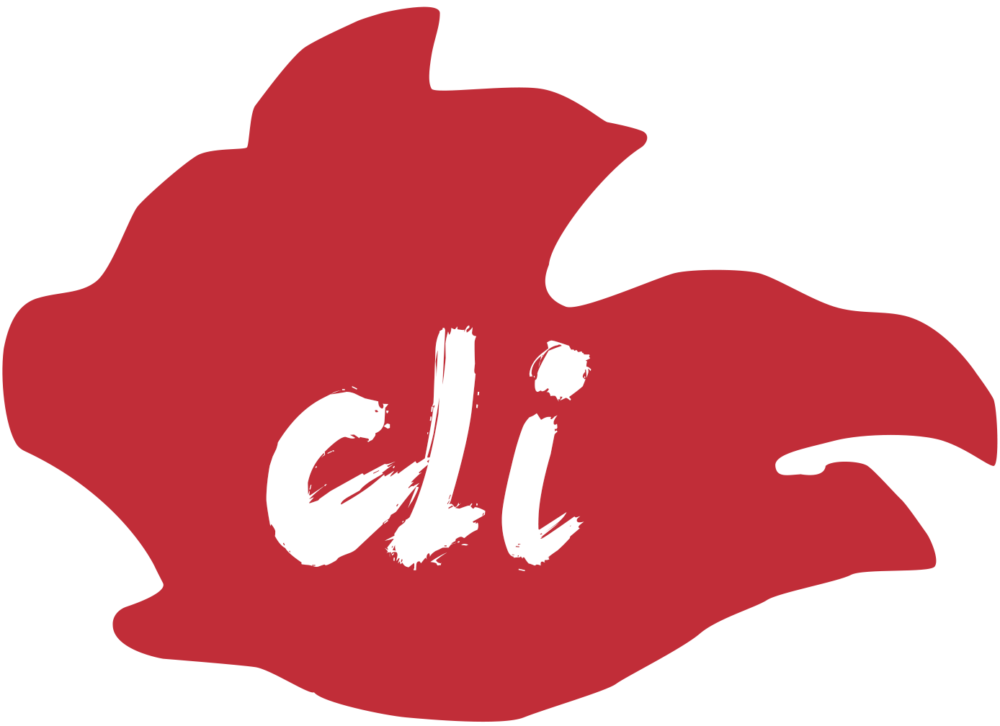

<p align="center">
  <a href="http://ui.zhuimengzhu.com">
    
  </a>
</p>

# 公告
``zmz-vuecli``  追梦猪vue脚手架全家桶减少重复性工作,提高工作效率,为快捷开发而生!（加q群:581764678）


## 特性

- 减少重复性工作
- 提高工作效率
- 快捷开发

## 安装

- npm

```bash
zmz-vuecli init <project name>

npm i或install
```


## 贡献

如果你在使用 `zmz-vuecli` 时遇到问题，或者有好的建议，欢迎给我们提 [Issue](https://github.com/jiawenguang/zmz-vuecli) 或 [Pull Request](https://github.com/jiawenguang/zmz-vuecli)


## Pull requests 规范

**Working on your first Pull Request?** You can learn how from this *free* series
[How to Contribute to an Open Source Project on GitHub](https://egghead.io/series/how-to-contribute-to-an-open-source-project-on-github)

All pull requests are welcome. Thanks for taking the time to contribute.

